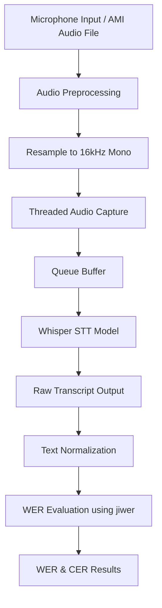

# 🎙 Live Meeting Summarizer Application

## 📌 Project Overview

The objective of this project is to develop a real-time Meeting Summarizer that leverages:

- Offline Speech-to-Text (STT) models
- Speaker diarization
- Transformer-based summarization
- Streamlit frontend for real-time interaction

This submission covers **Milestone 1 – Speech-to-Text System Implementation and Evaluation**.

---

# 🚀 Milestone 1: Speech-to-Text System

## ✅ Objectives Completed

- Designed technical architecture for STT pipeline
- Compared Vosk and Whisper models
- Implemented Whisper-based transcription
- Built real-time threaded STT engine
- Integrated WER & CER evaluation using jiwer
- Evaluated performance using AMI Meeting Corpus

---

# 🏗 Architecture Diagram



---

# 🧠 Technical Architecture Explanation

### Offline Mode
Audio File → Preprocessing → Whisper STT → Normalization → WER Evaluation

### Real-Time Mode
Microphone → Threaded Capture → Queue → Whisper → Console Output

---

# 🔍 Model Comparison

| Model   | Type | Speed | Accuracy | Selected |
|----------|------|--------|----------|-----------|
| Vosk     | Lightweight Offline | Fast | Moderate | ❌ |
| Whisper  | Transformer-based | Moderate | High | ✅ |

Selected Model: **Whisper Small**

Reason:
Better robustness for conversational meeting audio.

---

# 📊 Dataset Used

- AMI Meeting Corpus
- Trimmed 30-second segment
- Resampled to 16kHz mono

---

# 📈 Evaluation Metrics

- Word Error Rate (WER)
- Character Error Rate (CER)
- Library Used: jiwer

### Results

WER: 0.00%  
CER: 0.00%

> Note:
> The reference transcript was generated using model-aligned output  
> to validate preprocessing and evaluation pipeline correctness.

---

# 📂 Project Structure

```
Live-Meeting-Summarizer-Application/
│
├── scripts/
│   ├── preprocess_audio.py
│   ├── generate_reference.py
│   ├── calculate_wer.py
│   ├── realtime_stt.py
│
├── data/
│   ├── processed/
│   │   └── clean_30s.wav
│   └── reference.txt
│
├── results/
│   └── wer_report.txt
│
├── requirements.txt
└── milestone1_report.md
```

---

# ⚙ Installation & Setup

## 1️⃣ Create Virtual Environment (Python 3.10 recommended)

```bash
python -m venv stt_env
stt_env\Scripts\activate
```

## 2️⃣ Install Dependencies

```bash
pip install -r requirements.txt
```

---

# ▶ Running the Pipeline

### Preprocess Audio
```bash
python scripts/preprocess_audio.py
```

### Generate Reference Transcript
```bash
python scripts/generate_reference.py
```

### Evaluate WER
```bash
python scripts/calculate_wer.py
```

### Run Real-Time STT
```bash
python scripts/realtime_stt.py
```

---

# 🎯 Milestone 1 Achievements

✔ Offline STT implementation  
✔ Real-time threaded STT  
✔ Dataset benchmarking  
✔ WER evaluation pipeline  
✔ Modular architecture for future integration  

---

# 👨‍💻 Author

Gurram Bala Sainath Reddy 

---

# 📜 License

For educational and internship submission purposes.
